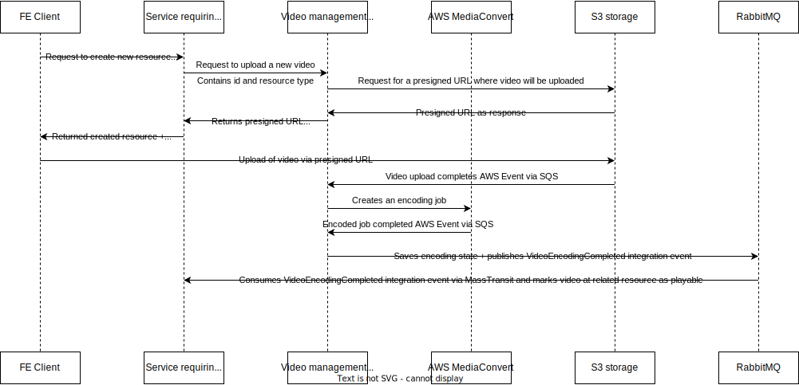
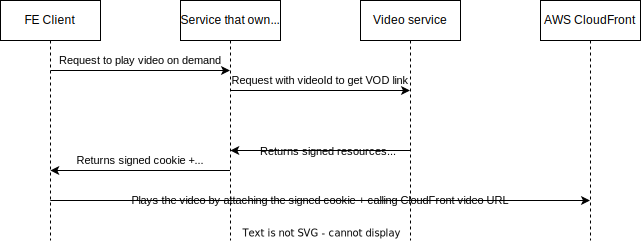

# Video Management - Video-On-Demand (VOD) Processing Service
## Introduction
This repository serves as a reference project to demonstrate gained knowledge and skills.
It's a picked service (and specifically adjusted for reference project purposes) from a private system/platform called `PowerTrainer` that I develop in my free time. 

Purpose of this service is to fulfill requirements that the system has to manage its own video content, following requirements are:
- Video content has to be private and exclusive for the platform (not accessible by outside  world), public platform like YouTube cannot be used
- Video content uploading and encoding for VOD formats
- Video on demand streaming (videos playable anytime)
- Video downloading

There are a few different services in the system that need to work with the video content, so that is why I decided to create a separate service managing directly those needs. It provides an API client that can be used by other services to start video uploading and encoding workflows. When those processes finish (by publishing integration events), those services can request necessary links for playing VOD and downloading the content. This content is distributted via CDN to make it private, secured and globally available with reasonable response time.

AWS was chosen because it provides all necessary components for VOD functionalities (MediaConvert, CloudFront, S3 bucket) to implement this service in optimal and scalable way.

The primary purpose of creating this service is to establish a clear separation between the PowerTrainer system and various AWS components (such as MediaConvert, CloudFront, S3 bucket, Amazon SQS, etc.) that are crucial to managing video content. This service plays a crucial role in handling AWS events through Amazon SQS. These events might include notifications of new video uploads needing encoding or alerts indicating the completion of video encoding.

The service processes these AWS events to trigger appropriate workflows. Additionally, it converts these AWS events into internal integration events that are tailored for the PowerTrainer platform. This conversion is significant because it allows other services within the platform to detect and respond to these events. For example, if a service has requested a video upload for future playback, the video management component will issue an integration event once the video is successfully encoded. This event informs the service that the video is now ready for use, ensuring smooth delivery and playback as per the original request.

The service additionally plays a key role in controlling access to the video content. It ensures that only authorized services have the capability to interact with the video content. This is crucial for maintaining the security and privacy of the content. To achieve this, the service utilizes CloudFront signed URLs and cookies, as detailed in the AWS documentation ([CloudFront signed URLs and cookies](https://docs.aws.amazon.com/AmazonCloudFront/latest/DeveloperGuide/PrivateContent.html)). This method ensures that access to the video content is not only restricted to permitted entities but also securely managed, maintaining the integrity and confidentiality of the video data.

## Technologies Used
- **.NET 8/C# 12**
- **ASP.NET Core**
- **EF Core 8** - ORM
- **[Mediator](https://github.com/martinothamar/Mediator)** - Implements Mediator pattern
- **Docker** - Running services in containers
- **Testcontainers** - Used for running real database instance as docker container in integration tests
- AWS Services
    - **Amazon S3** - Storage for uploading videos to be encoded + storing and serving encoded content via CLoudFront
    - **MediaConvert** - Tool for encoding videos to VOD format
    - **EventBridge and Amazon SQS** - S3 and MediaConvert crete events that are published to SQS for processing by this service 
    - **CloudFront** - CDN used for distributing the video content globally, secured and private
- **RabbitMQ** - Message broker used for event driven design, async communication between services
- **MassTransit** - Abstraction over message broker (RMQ) providing features and integrations that are beneficial for building scalable and maintainable distributed systems 
- **Outbox pattern** - Outbox implementation for storing domain events in database that are later on published and handled by mediator notifications handler. So database changes and message publishing/side-effects are in one transaction.
- **Quartz.NET** - scheduler used for outbox implementation

## Use Cases
### Use Case 1: Video upload and encoding for VOD formats


Client initiates the resource creation with the related video file. Given service that needs the video content creates a request to video management service that creates presigned URL where the video file should be uploaded.
This URL is returned to the client that uploads the given video file. Upon successful upload to S3, it triggers an event that is captured by Video management service. This event is then processed by the service to start the video encoding process. Once the video is successfully encoded, the service publishes an integration event that is captured by the client service. This event contains the necessary information for the client service to retrieve the encoded video content.

### Use Case 2: Playing a video on demand


If FE Client needs to play a video, it requests the owner service of the video to get the video URL. The owner service requests the video management service to get all signed resources to construct short lived signed credential cookie that the fe client will ues for the video access. The video management service then returns the signed resources for the video content, which is then returned to the owning service. This service constructs the signed credential cookie and returns it to the FE client alongside with the CloudFront URL. The FE client then uses this cookie and link to access the video content via CloudFront.

### Use Case 3: Video download


If FE Client needs to download a video, it requests the owner service of the video to get the video URL. The owner service requests the video management service to get short lived signed url for the video file. If the owner service is authorized to download a video, video management returns the signed CloudFront URL. The FE client then uses this link to download the video content. 

## Project Structure
```
├───Common  (Reusable functionalities, can be exported as nuget)
│   ├───Abstractions
│   ├───Auth (Authentication and authorization features)
│   │   ├───Handlers (Http message handler for adding access tokens to request)
│   │   ├───TestHelpers
│   │   └───TokenServices (Services for retrieving and caching access token)
│   ├───Middleware
│   ├───Repositories (Repositories abstractions)
│   ├───ResultTypes (Implementation of result pattern with OneOf)
│   ├───Swagger
│   └───Validations (Validation pipeline behavior for mediator)
├───VideoManagement (Service implementation)
│   ├───Database (DB Entities configuration, DbContext, ...)
│   ├───Features
│   │   ├───BlobStorage (Storage services)
│   │   ├───Media (Media encoding services)
│   │   ├───Resource (Resource signing services)
│   │   └───Videos (Video related features)
│   │       ├───DomainEvents (Video domain events with specific handlers)
│   │       ├───Download (Video download related features)
│   │       ├───Encode (Video encoding related features)
│   │       │   ├───EncodingCompleted
│   │       │   ├───EncodingFailed
│   │       │   └───MediaConvertEvents (Events from AWS Media Convert)
│   │       ├───Entity (Video related entities)
│   │       ├───Repository (Video related repositories)
│   │       ├───Stream (Video streaming related features)
│   │       └───Upload (Video upload related features)
│   ├───Migrations (EF Core migrations)
│   ├───Options (Option pattern used for configuration)
│   ├───Outbox (Outbox pattern job implementation)
│   └───Properties
└───VideoManagement.Contracts (Contracts published as nuget for other services)
    ├───Api (Video management client)
    │   └───V1
    └───IntegrationEvents (Integration events published by video management)
```
## Configuration

```json
{
"Database": { 
    "ConnectionString": "<PLACEHOLDER>" // Connection string to the database, where information about videos and their status is stored
  },
  "AWS": {
    "Profile": "<PLACEHOLDER>", // AWS profile name
    "Region": "<PLACEHOLDER>" // AWS region
  },
  "BlobStorage": {
    "BucketName": "<PLACEHOLDER>" // S3 bucket name, where videos are uploaded and stored
  },
  "Sqs": {
    "VideoUploadedQueue": "<PLACEHOLDER>", // SQS queue name, where video uploaded events are published
    "EncodingFailedQueue": "<PLACEHOLDER>", // SQS queue name, where video encoding failed events are published
    "EncodingCompletedQueue": "<PLACEHOLDER>", // SQS queue name, where video encoding completed events are published
    "WaitTimeSeconds": 15 // Wait time for SQS polling
  },
  "MediaService": {
    "MediaConvertRole": "<PLACEHOLDER>", // IAM role for MediaConvert
    "MediaConvertEndpoint": "<PLACEHOLDER>" // MediaConvert endpoint for creating encoding jobs
  },
  "CloudFront": {
    "Url": "<PLACEHOLDER>", // CloudFront URL for accessing video
    "PublicKeyId": "<PLACEHOLDER>", // CloudFront public key id for signing cookies
    "PrivateKeyLocation": "<PLACEHOLDER>", // Path to private key for signing cookies
    "LinkLifetimeInMinutes": 5 // Lifetime of signed cookies or URLs
  },
  "Outbox": {
    "IntervalInSeconds": 10, // Polling interval for outbox job
    "BatchSize": 10 // Number of outbox events to process in one batch
  },
  "MessageBroker": { // RabbitMQ configuration, where integration events are published
    "Host": "<PLACEHOLDER>",
    "Username": "<PLACEHOLDER>",
    "Password": "<PLACEHOLDER>"
  },
  "JwtSettings": { // JWT settings for authentication and authorization via Keycloak
    "ClientId": "<PLACEHOLDER>",
    "ClientSecret": "<PLACEHOLDER>",
    "AuthServer": "<PLACEHOLDER>",
    "Realm": "<PLACEHOLDER>",
    "Audiences": [
      "<PLACEHOLDER>"
    ],
    "ValidateAudience": true,
    "ClockSkewInSeconds": 5,
    "AuthenticationScheme": "Bearer"
  }
}
```
## Nuget packages
The video client nuget package is published as part of the CI/CD pipeline when a vX.Y.Z tag is specified. You can find the contract package here [Video Management Client package](https://github.com/PetrKoller/VideoManagement/pkgs/nuget/PowerTrainer.VideoManagement.Contracts)
